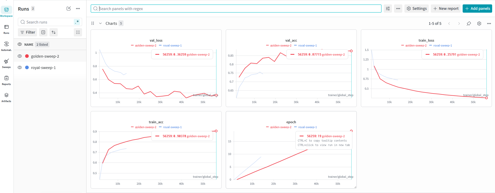
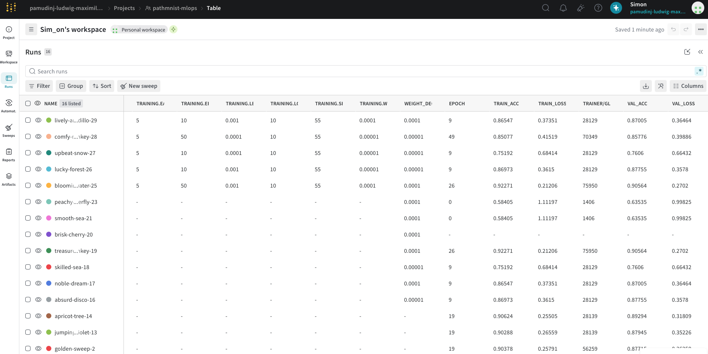
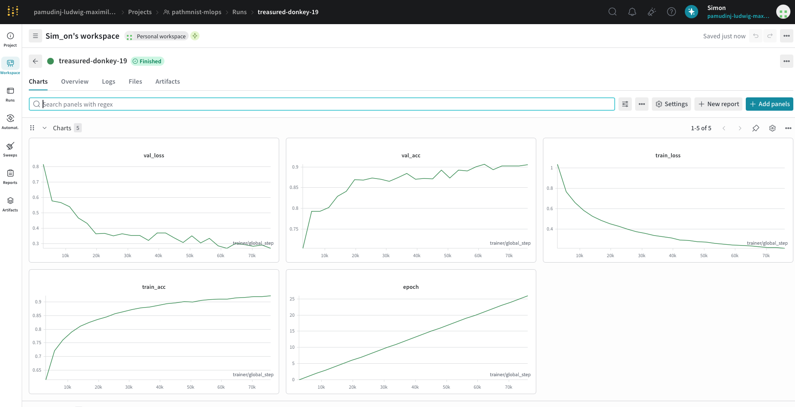
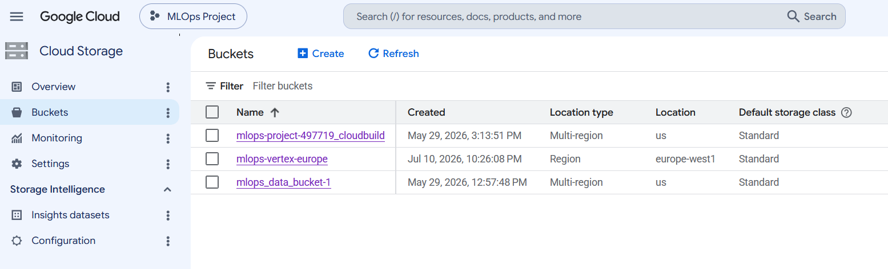
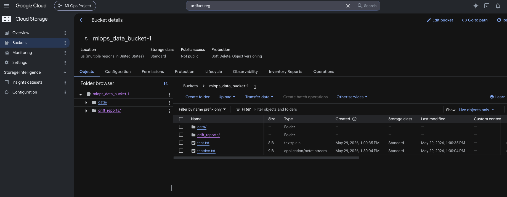
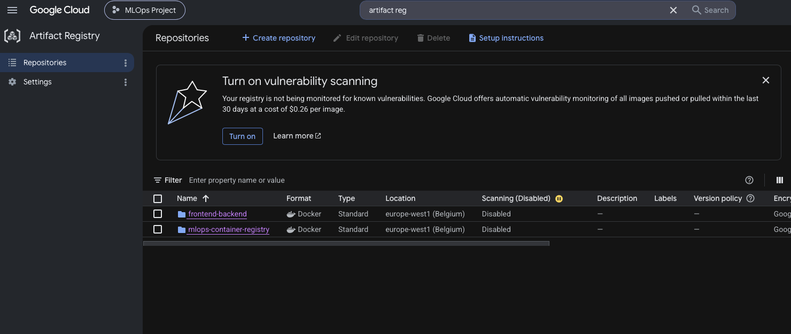
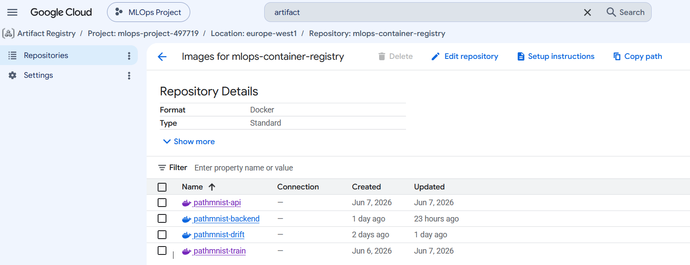
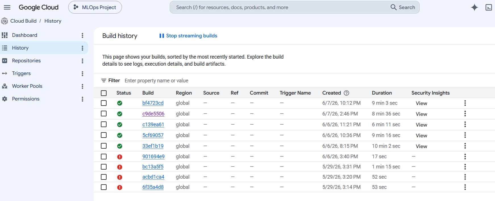
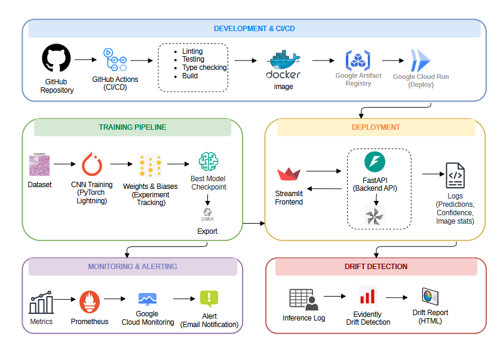

# Exam template for 02476 Machine Learning Operations

This is the report template for the exam. Please only remove the text formatted as with three dashes in front and behind
like:

```--- question 1 fill here ---```

Where you instead should add your answers. Any other changes may have unwanted consequences when your report is
auto-generated at the end of the course. For questions where you are asked to include images, start by adding the image
to the `figures` subfolder (please only use `.png`, `.jpg` or `.jpeg`) and then add the following code in your answer:

``

In addition to this markdown file, we also provide the `report.py` script that provides two utility functions:

Running:

```bash
python report.py html
```

Will generate a `.html` page of your report. After the deadline for answering this template, we will auto-scrape
everything in this `reports` folder and then use this utility to generate a `.html` page that will be your serve
as your final hand-in.

Running

```bash
python report.py check
```

Will check your answers in this template against the constraints listed for each question e.g. is your answer too
short, too long, or have you included an image when asked. For both functions to work you mustn't rename anything.
The script has two dependencies that can be installed with

```bash
pip install typer markdown
```

or

```bash
uv add typer markdown
```

## Overall project checklist

The checklist is *exhaustive* which means that it includes everything that you could do on the project included in the
curriculum in this course. Therefore, we do not expect at all that you have checked all boxes at the end of the project.
The parenthesis at the end indicates what module the bullet point is related to. Please be honest in your answers, we
will check the repositories and the code to verify your answers.

### Week 1

* [X] Create a git repository (M5)
* [X] Make sure that all team members have write access to the GitHub repository (M5)
* [X] Create a dedicated environment for you project to keep track of your packages (M2)
* [X] Create the initial file structure using cookiecutter with an appropriate template (M6)
* [X] Fill out the `data.py` file such that it downloads whatever data you need and preprocesses it (if necessary) (M6)
* [X] Add a model to `model.py` and a training procedure to `train.py` and get that running (M6)
* [X] Remember to either fill out the `requirements.txt`/`requirements_dev.txt` files or keeping your
    `pyproject.toml`/`uv.lock` up-to-date with whatever dependencies that you are using (M2+M6)
* [X] Remember to comply with good coding practices (`pep8`) while doing the project (M7)
* [X] Do a bit of code typing and remember to document essential parts of your code (M7)
* [X] Setup version control for your data or part of your data (M8)
* [X] Add command line interfaces and project commands to your code where it makes sense (M9)
* [X] Construct one or multiple docker files for your code (M10)
* [X] Build the docker files locally and make sure they work as intended (M10)
* [X] Write one or multiple configurations files for your experiments (M11)
* [X] Used Hydra to load the configurations and manage your hyperparameters (M11)
* [X] Use profiling to optimize your code (M12)
* [X] Use logging to log important events in your code (M14)
* [X] Use Weights & Biases to log training progress and other important metrics/artifacts in your code (M14)
* [X] Consider running a hyperparameter optimization sweep (M14)
* [X] Use PyTorch-lightning (if applicable) to reduce the amount of boilerplate in your code (M15)

### Week 2

* [X] Write unit tests related to the data part of your code (M16)
* [X] Write unit tests related to model construction and or model training (M16)
* [X] Calculate the code coverage (M16)
* [X] Get some continuous integration running on the GitHub repository (M17)
* [X] Add caching and multi-os/python/pytorch testing to your continuous integration (M17)
* [X] Add a linting step to your continuous integration (M17)
* [X] Add pre-commit hooks to your version control setup (M18)
* [X] Add a continues workflow that triggers when data changes (M19)
* [X] Add a continues workflow that triggers when changes to the model registry is made (M19)
* [X] Create a data storage in GCP Bucket for your data and link this with your data version control setup (M21)
* [X] Create a trigger workflow for automatically building your docker images (M21)
* [X] Get your model training in GCP using either the Engine or Vertex AI (M21)
* [X] Create a FastAPI application that can do inference using your model (M22)
* [X] Deploy your model in GCP using either Functions or Run as the backend (M23)
* [X] Write API tests for your application and setup continues integration for these (M24)
* [X] Load test your application (M24)
* [X] Create a more specialized ML-deployment API using either ONNX or BentoML, or both (M25)
* [X] Create a frontend for your API (M26)

### Week 3

* [X] Check how robust your model is towards data drifting (M27)
* [X] Setup collection of input-output data from your deployed application (M27)
* [X] Deploy to the cloud a drift detection API (M27)
* [X] Instrument your API with a couple of system metrics (M28)
* [X] Setup cloud monitoring of your instrumented application (M28)
* [X] Create one or more alert systems in GCP to alert you if your app is not behaving correctly (M28)
* [X] If applicable, optimize the performance of your data loading using distributed data loading (M29)
* [X] If applicable, optimize the performance of your training pipeline by using distributed training (M30)
* [X] Play around with quantization, compilation and pruning for you trained models to increase inference speed (M31)

### Extra

* [X] Write some documentation for your application (M32)
* [X] Publish the documentation to GitHub Pages (M32)
* [X] Revisit your initial project description. Did the project turn out as you wanted?
* [X] Create an architectural diagram over your MLOps pipeline
* [X] Make sure all group members have an understanding about all parts of the project
* [X] Uploaded all your code to GitHub

## Group information

### Question 1
> **Enter the group number you signed up on <learn.inside.dtu.dk>**
>
> Answer:

Group E

### Question 2
> **Enter the study number for each member in the group**
>
> Example:
>
> *sXXXXXX, sXXXXXX, sXXXXXX*
>
> Answer:

--- question 2 fill here ---

### Question 3
> **Did you end up using any open-source frameworks/packages not covered in the course during your project? If so**
> **which did you use and how did they help you complete the project?**
>
> Recommended answer length: 0-200 words.
>
> Example:
> *We used the third-party framework ... in our project. We used functionality ... and functionality ... from the*
> *package to do ... and ... in our project*.
>
> Answer:

Yes. We used the MedMNIST package, which was not part of the course material, to provide access to the PathMNIST dataset used throughout the project. The package offers a standardized interface for downloading, loading, and managing the train, validation, and test splits, allowing us to integrate the dataset directly into PyTorch dataloaders with minimal preprocessing. This reduced the amount of custom data handling code and ensured that our experiments were reproducible. In addition, MedMNIST provides benchmark datasets specifically designed for medical image classification, making it well suited for evaluating our convolutional neural network. By using MedMNIST, we were able to focus on implementing the MLOps pipeline including model training, deployment, monitoring, and drift detection rather than spending time on dataset preparation and organization.

## Coding environment

> In the following section we are interested in learning more about you local development environment. This includes
> how you managed dependencies, the structure of your code and how you managed code quality.

### Question 4

> **Explain how you managed dependencies in your project? Explain the process a new team member would have to go**
> **through to get an exact copy of your environment.**
>
> Recommended answer length: 100-200 words
>
> Example:
> *We used ... for managing our dependencies. The list of dependencies was auto-generated using ... . To get a*
> *complete copy of our development environment, one would have to run the following commands*
>
> Answer:

We managed dependencies using pip within a dedicated Python virtual environment. The project dependencies were maintained through requirement files, including separate `requirements_backend.txt` and `requirements_frontend.txt` for the deployment services. Docker was also used to package the backend and frontend into reproducible containers, ensuring consistent execution across different environments. To obtain an identical development environment, a new team member would clone the GitHub repository, create and activate a virtual environment, and install the required dependencies using pip.

The setup process is:

```bash
git clone <GitHub_repository_URL>
cd <project_directory>

invoke create-env
```

Alternatively:

```bash
git clone <GitHub_repository_URL>
cd <project_directory>

python3.12 -m venv .venv
source .venv/bin/activate      # Linux/macOS
.venv\Scripts\activate       # Windows

pip install -r requirements.txt
pip install -r requirements_frontend.txt
pip install -r requirements_backend.txt
pip install -r requirements_dev.txt
pip install -e .

dvc pull # download data
```

### Question 5

> **We expect that you initialized your project using the cookiecutter template. Explain the overall structure of your**
> **code. What did you fill out? Did you deviate from the template in some way?**
>
> Recommended answer length: 100-200 words
>
> Example:
> *From the cookiecutter template we have filled out the ... , ... and ... folder. We have removed the ... folder*
> *because we did not use any ... in our project. We have added an ... folder that contains ... for running our*
> *experiments.*
>
> Answer:

We initialized the project using the DTU MLOps cookiecutter template and preserved its overall directory structure. The main development took place in the src/pathmnist_mlops package, where we implemented modules for data loading `data.py`, model training `train.py`, evaluation `evaluate.py`, FastAPI inference `api.py`, ONNX inference `api_onnx.py`, ONNX model export `export_onnx.py`, data drift detection `data_drift.py` and `drift_api.py`, dataset statistics, and inference optimization. The tests directory was expanded with unit, API, and performance tests, while the dockerfiles directory was extended with Dockerfiles for the backend, frontend, and drift detection service. We also added a monitoring directory containing monitoring and alert configuration files for Google Cloud Monitoring. In addition, we customized the project by integrating DVC for data versioning, GitHub Actions for continuous integration, Weights & Biases (W&B) for experiment tracking, and Google Cloud Run for deployment, while keeping the original cookiecutter organization intact. At this stage of the project, we did not make modifications to some of the template folders, including notebooks, and .devcontainer. We added models to the models folder locally, but did not push those to the repo.

### Question 6

> **Did you implement any rules for code quality and format? What about typing and documentation? Additionally,**
> **explain with your own words why these concepts matters in larger projects.**
>
> Recommended answer length: 100-200 words.
>
> Example:
> *We used ... for linting and ... for formatting. We also used ... for typing and ... for documentation. These*
> *concepts are important in larger projects because ... . For example, typing ...*
>
> Answer:

Yes. We implemented several code quality practices throughout the project. Ruff was used for both linting and code formatting to ensure a consistent coding style and detect common programming issues. mypy was used for static type checking, helping identify type-related errors before runtime. We also configured pre-commit hooks to automatically run quality checks before each commit, and GitHub Actions to execute these checks as part of the continuous integration pipeline. In addition, we documented our modules and functions using Python docstrings and included type hints throughout the codebase to improve readability and maintainability. Automated quality checks ensure that coding standards are applied consistently across the project, reducing integration issues and making the codebase more reliable and maintainable over time.

## Version control

> In the following section we are interested in how version control was used in your project during development to
> corporate and increase the quality of your code.

### Question 7

> **How many tests did you implement and what are they testing in your code?**
>
> Recommended answer length: 50-100 words.
>
> Example:
> *In total we have implemented X tests. Primarily we are testing ... and ... as these the most critical parts of our*
> *application but also ... .*
>
> Answer:

We implemented 21 automated tests and one performance test. The automated tests cover the data pipeline, model, training module, and both inference APIs. They verify dataset loading, dataloader outputs, model initialization, forward passes, optimizer configuration, training and validation steps, API endpoints, prediction functionality, inference logging, and Prometheus metrics. We also implemented a Locust performance test to evaluate the inference API under concurrent user requests.

### Question 8

> **What is the total code coverage (in percentage) of your code? If your code had a code coverage of 100% (or close**
> **to), would you still trust it to be error free? Explain you reasoning.**
>
> Recommended answer length: 100-200 words.
>
> Example:
> *The total code coverage of code is X%, which includes all our source code. We are far from 100% coverage of our **
> *code and even if we were then...*
>
> Answer:

The overall code coverage of our project is 72%. The highest coverage was achieved for the core components, with 80% coverage for both the data loading and model modules. The FastAPI inference API achieved 75% coverage, the training pipeline 71%, and the ONNX inference API 66%. The remaining uncovered code is primarily related to application startup, configuration, external service integration, and training orchestration, which are difficult to validate using isolated unit tests and are more appropriately tested through integration or end-to-end testing. Even if our code coverage were close to 100%, we would not assume the software to be error free. Code coverage only measures which lines of code were executed during testing. It does not guarantee that the tests verify correct behavior or cover all edge cases. Therefore, meaningful test design, integration testing, static analysis, and code reviews remain essential for ensuring software quality.

### Question 9

> **Did you workflow include using branches and pull requests? If yes, explain how. If not, explain how branches and**
> **pull request can help improve version control.**
>
> Recommended answer length: 100-200 words.
>
> Example:
> *We made use of both branches and PRs in our project. In our group, each member had an branch that they worked on in*
> *addition to the main branch. To merge code we ...*
>
> Answer:

Yes. We followed a branch-based development workflow throughout the project. Our team maintained a stable main branch and used a shared develop branch for integrating new features. Individual changes were first committed and pushed to the develop branch, where automated quality checks and tests were executed through our GitHub Actions continuous integration pipeline. Only after these checks passed successfully were the changes merged into the main branch using a Pull Request (PR). Pull requests allowed team members to review each other's code, discuss implementation decisions, and identify potential issues before merging. This workflow helped prevent unstable or untested code from reaching the main branch while maintaining a clear history of changes. Using branches and pull requests also made collaboration more organized by allowing multiple team members to work on different tasks simultaneously without interfering with each other's work, ultimately improving code quality, traceability, and project maintainability.

### Question 10

> **Did you use DVC for managing data in your project? If yes, then how did it improve your project to have version**
> **control of your data. If no, explain a case where it would be beneficial to have version control of your data.**
>
> Recommended answer length: 100-200 words.
>
> Example:
> *We did make use of DVC in the following way: ... . In the end it helped us in ... for controlling ... part of our*
> *pipeline*
>
> Answer:

Yes. We integrated Data Version Control (DVC) into our project to version the original PathMNIST dataset and also the drifted dataset, and configure remote storage for managing data outside the Git repository. Since the original dataset remained unchanged throughout the project, we did not create multiple dataset versions after the initial setup. However, using DVC demonstrated how large datasets can be tracked without storing them directly in Git and ensured that all team members could access the same data used for training and evaluation. The DVC metadata files were version controlled alongside the source code, helping maintain consistency between the codebase and the dataset. Although our project did not require any dataset update, DVC provides an effective solution for larger projects where datasets evolve over time, allowing previous versions to be reproduced, shared, and restored while keeping the Git repository lightweight.

### Question 11

> **Discuss you continuous integration setup. What kind of continuous integration are you running (unittesting,**
> **linting, etc.)? Do you test multiple operating systems, Python  version etc. Do you make use of caching? Feel free**
> **to insert a link to one of your GitHub actions workflow.**
>
> Recommended answer length: 200-300 words.
>
> Example:
> *We have organized our continuous integration into 3 separate files: one for doing ..., one for running ... testing*
> *and one for running ... . In particular for our ..., we used ... .An example of a triggered workflow can be seen*
> *here: <weblink>*
>
> Answer:

We organized our continuous integration into multiple GitHub Actions workflows, each responsible for a different aspect of the project. Separate workflows were created for unit testing, API testing, code linting, DVC integration, model registry evaluation, and container building. Most workflows are triggered by `pull requests to the main branch`, while the container build workflow is triggered by pushes affecting deployment-related files. We also used path-based triggers so that workflows only run when relevant files are modified, reducing unnecessary CI execution.
The code quality workflow checks formatting using Ruff and performs static type checking with mypy. The unit testing workflow executes the complete test suite, generates a coverage report, and runs on both Ubuntu and Windows using Python 3.12 to verify cross-platform compatibility. The API workflow validates the FastAPI endpoints, while the DVC workflow authenticates with Google Cloud, retrieves the tracked dataset, and runs dataset statistics. The model registry workflow evaluates the latest model stored in Weights & Biases, and a separate workflow submits a Google Cloud Build job to build the training container. We also enabled pip dependency caching in several workflows to reduce installation time. Overall, our CI pipeline automatically validates code quality, testing, data management, model evaluation, and deployment, helping maintain a reliable and reproducible MLOps workflow.
Workflows: https://github.com/pamudinj/MLOps_Project_LSP/tree/main/.github/workflows

## Running code and tracking experiments

> In the following section we are interested in learning more about the experimental setup for running your code and
> especially the reproducibility of your experiments.

### Question 12

> **How did you configure experiments? Did you make use of config files? Explain with coding examples of how you would**
> **run a experiment.**
>
> Recommended answer length: 50-100 words.
>
> Example:
> *We used a simple argparser, that worked in the following way: Python  my_script.py --lr 1e-3 --batch_size 25*
>
> Answer:

We configured our experiments using Hydra configuration files and Weights & Biases Sweeps. The default training parameters, such as learning rate, batch size, number of epochs, and logging frequency, were stored in `configs/config.yaml`, while `configs/sweep.yaml` defined the hyperparameter search space for W&B Sweeps. Experiments were executed using Hydra, for example:

`python -m pathmnist_mlops.train training.learning_rate=0.001 training.batch_size=64 training.epochs=20`

For hyperparameter optimization, we launched a W&B sweep using the configuration in `configs/sweep.yaml`.

### Question 13

> **Reproducibility of experiments are important. Related to the last question, how did you secure that no information**
> **is lost when running experiments and that your experiments are reproducible?**
>
> Recommended answer length: 100-200 words.
>
> Example:
> *We made use of config files. Whenever an experiment is run the following happens: ... . To reproduce an experiment*
> *one would have to do ...*
>
> Answer:

We used several mechanisms to ensure that our experiments were reproducible and that no important information was lost. Training parameters such as the random seed, learning rate, batch size, number of epochs, and logging frequency were stored in Hydra configuration files, ensuring that experiments were executed with well-defined settings. W&B automatically logged the hyperparameters, training and validation metrics, and stored the best model as an artifact in the model registry, allowing experiments to be reproduced and compared later. The dataset was managed using DVC, ensuring that the same version of the training data could be retrieved when needed, while Git tracked changes to the source code. Finally, project dependencies were recorded in the `requirements.txt` files, allowing the same software environment to be recreated. Together, these tools ensured that an experiment could be reproduced by checking out the corresponding code version, retrieving the tracked dataset, installing the required dependencies, and running the training script with the same Hydra configuration.

### Question 14

> **Upload 1 to 3 screenshots that show the experiments that you have done in W&B (or another experiment tracking**
> **service of your choice). This may include loss graphs, logged images, hyperparameter sweeps etc. You can take**
> **inspiration from [this figure](figures/wandb.png). Explain what metrics you are tracking and why they are**
> **important.**
>
> Recommended answer length: 200-300 words + 1 to 3 screenshots.
>
> Example:
> *As seen in the first image when have tracked ... and ... which both inform us about ... in our experiments.*
> *As seen in the second image we are also tracking ... and ...*
>
> Answer:

During model development, we used W&B to track and compare the results of multiple training experiments. Figure 1 shows several runs from hyperparameter sweeps, where different learning rates, batch sizes, and numbers of epochs were evaluated. W&B automatically logged the training configuration together with the resulting performance metrics, making it easy to compare experiments and identify the best-performing model.

The main metrics we monitored were training loss, validation loss, training accuracy, and validation accuracy. Training and validation loss measure how well the model minimizes the classification error during optimization, while the corresponding accuracy metrics indicate how well the model predicts the correct tissue class. Monitoring both training and validation metrics is important because it helps identify underfitting and overfitting. For example, decreasing training loss together with increasing validation accuracy indicates that the model is learning meaningful features and generalizing well to unseen data. We also tracked the current epoch and training progress to monitor convergence throughout the optimization process.

As shown in Figure 3, the run treasured-donkey-19  the highest validation accuracy and was therefore selected as the best-performing configuration. W&B also stored the corresponding hyperparameters and model artifact, allowing the experiment to be reproduced and compared with future experiments.


Figure 1: W&B Training


Figure 2: W&B Runs


Figure 3: Best Model

### Question 15

> **Docker is an important tool for creating containerized applications. Explain how you used docker in your**
> **experiments/project? Include how you would run your docker images and include a link to one of your docker files.**
>
> Recommended answer length: 100-200 words.
>
> Example:
> *For our project we developed several images: one for training, inference and deployment. For example to run the*
> *training docker image: `docker run trainer:latest lr=1e-3 batch_size=64`. Link to docker file: <weblink>*
>
> Answer:

We used Docker to containerize the different components of our MLOps application, ensuring a consistent execution environment across local development and Google Cloud. We created separate Dockerfiles for the training pipeline `train.dockerfile`, FastAPI backend `backend.dockerfile`, model inference API `api.dockerfile`, Streamlit frontend `frontend.dockerfile`, and drift detection API `drift_api.dockerfile`. This separation allowed each service to be built and deployed independently according to its specific purpose. The containers were used for local testing as well as deployment to Google Cloud Run and Google Cloud Build. For example, the backend container can be built and executed using:

```bash
docker build -t pathmnist-backend:latest -f dockerfiles/backend.dockerfile .
docker run -p 8000:8000 backend:latest
```

Similarly, the frontend can be started with:

```bash
docker build -t pathmnist-frontend:latest -f dockerfiles/frontend.dockerfile .
docker run -p 8501:8501 frontend:latest
```

The Dockerfiles are available in the repository under the dockerfiles/ directory. For example: https://github.com/pamudinj/MLOps_Project_LSP/blob/main/dockerfiles/backend.dockerfile.

### Question 16

> **When running into bugs while trying to run your experiments, how did you perform debugging? Additionally, did you**
> **try to profile your code or do you think it is already perfect?**
>
> Recommended answer length: 100-200 words.
>
> Example:
> *Debugging method was dependent on group member. Some just used ... and others used ... . We did a single profiling*
> *run of our main code at some point that showed ...*
>
> Answer:

During development, we used several debugging techniques to identify and resolve issues in our MLOps pipeline. Python logging was extensively used to trace the execution of data loading, training, evaluation, and deployment steps. We also relied on PyTorch Lightning's built-in logging and checkpointing to monitor training progress and verify that metrics such as training loss and validation accuracy behaved as expected. Weights & Biases was particularly useful for visualizing experiment results, comparing runs, and identifying problems related to hyperparameter configurations. For cloud-based training, Vertex AI job logs helped diagnose execution failures and configuration issues. To evaluate performance, we profiled the training process using PyTorch Lightning's `PyTorchProfiler`, which generated execution traces and memory usage statistics. The profiler confirms that the training pipeline was functioning efficiently while highlighting the most computationally intensive operations. The computationally most expensive operation, according to the report, is the copying of tensors into the memory during runtime.
For evaluating performance of python files, for example the data.py, one can run
```bash
python -m cProfile -o profiler_logs/data_profile.prof src/pathmnist_mlops/data.py
```

## Working in the cloud

> In the following section we would like to know more about your experience when developing in the cloud.

### Question 17

> **List all the GCP services that you made use of in your project and shortly explain what each service does?**
>
> Recommended answer length: 50-200 words.
>
> Example:
> *We used the following two services: Engine and Bucket. Engine is used for... and Bucket is used for...*
>
> Answer:

We used the following Google Cloud Platform services:

- Cloud Run – deployed the FastAPI backend, Streamlit frontend, and drift detection API as serverless services.
- Cloud Storage (GCS) – used as the remote storage for DVC to version and store the dataset.
- Cloud Build – built Docker container images directly from the repository using a Cloud Build configuration.
- Artifact Registry – stored the Docker container images before deployment to Cloud Run.
- Vertex AI – configured to run model training jobs in the cloud.
- Cloud Monitoring – collected application metrics and monitored the deployed services.
- Cloud Alerting – created alert policies to notify us when application metrics exceeded predefined thresholds.

Together, these services provided a complete cloud-based workflow for training, deployment, monitoring, and data management.

### Question 18

> **The backbone of GCP is the Compute engine. Explained how you made use of this service and what type of VMs**
> **you used?**
>
> Recommended answer length: 100-200 words.
>
> Example:
> *We used the compute engine to run our ... . We used instances with the following hardware: ... and we started the*
> *using a custom container: ...*
>
> Answer:

We created a Google Compute Engine virtual machine as part of exploring the GCP infrastructure. The instance ran Ubuntu in the europe-west1-b zone and allowed us to become familiar with managing cloud virtual machines, including connecting to the instance and configuring the Google Cloud environment. However, it was not used for model training. Instead, our application was deployed using Cloud Run, while Cloud Build, Artifact Registry, and Vertex AI were used for building, managing, and executing the training workflow. We also launched a custom training job on Vertex AI using our Docker training container, which automatically provisioned the required compute resources without requiring manual VM management. This approach simplified training, ensured a consistent execution environment, and integrated naturally with the rest of our cloud-based MLOps pipeline.

### Question 19

> **Insert 1-2 images of your GCP bucket, such that we can see what data you have stored in it.**
> **You can take inspiration from [this figure](figures/bucket.png).**
>
> Answer:

Figure 4 shows the Google Cloud Storage buckets used in our project. The `mlops_data_bucket-1` bucket was configured as the remote storage for DVC, allowing dataset files to be versioned without storing them directly in the Git repository. The `mlops-project-497719_cloudbuild` bucket was automatically created and used by Google Cloud Build to store temporary build artifacts during container builds. The `mlops-vertex-europe` bucket was created as the staging bucket for Vertex AI custom training jobs, where Vertex AI stores intermediate outputs and training artifacts.


Figure 4: GCP buckets

Figure 5 shows the contents of the DVC storage bucket, illustrating the dataset objects tracked remotely by DVC. Storing the data in Cloud Storage allowed all team members to access the same dataset version and improved the reproducibility of our experiments while keeping the Git repository lightweight.


Figure 5: Data bucket

### Question 20

> **Upload 1-2 images of your GCP artifact registry, such that we can see the different docker images that you have**
> **stored. You can take inspiration from [this figure](figures/registry.png).**
>
> Answer:

The screenshots below show the Google Artifact Registry used in our project to store Docker container images before deployment. We created two repositories, with `mlops-container-registry` serving as the primary repository for our application images. As shown in Figure 7, the registry contains separate Docker images for the different components of our MLOps pipeline, including the training container `pathmnist-train`, backend `pathmnist-backend`, frontend `pathmnist-frontend`, inference API `pathmnist-api`, and drift detection service `pathmnist-drift`. These images were built using Google Cloud Build and stored in Artifact Registry before being deployed to Google Cloud Run. Storing container images in Artifact Registry provides centralized version management, making it easy to deploy, update, and maintain consistent container images.


Figure 6: Artifact Registry


Figure 7: Docker images

### Question 21

> **Upload 1-2 images of your GCP cloud build history, so we can see the history of the images that have been build in**
> **your project. You can take inspiration from [this figure](figures/build.png).**
>
> Answer:

The screenshot below shows the Google Cloud Build history for our project. Cloud Build was used to automatically build Docker images from our repository before deployment. The build history provides a record of all build attempts, including their status, creation time, duration, and build identifier. During development, several builds initially failed while we resolved dependency and configuration issues. After these were fixed, subsequent builds completed successfully and produced the Docker images that were stored in Artifact Registry and later deployed to Google Cloud Run. Maintaining the build history allowed us to verify that changes to the application could be built successfully and helped diagnose build failures by providing detailed logs and execution information.


Figure 8: Cloud Build history

### Question 22

> **Did you manage to train your model in the cloud using either the Engine or Vertex AI? If yes, explain how you did**
> **it. If not, describe why.**
>
> Recommended answer length: 100-200 words.
>
> Example:
> *We managed to train our model in the cloud using the Engine. We did this by ... . The reason we choose the Engine*
> *was because ...*
>
> Answer:

We successfully trained our model on Google Cloud using Vertex AI Custom Training Jobs. The training application was first packaged into a Docker container and stored in Artifact Registry using Cloud Build. A Python script was then used to launch Vertex AI training jobs by reading the hyperparameter search space from the `sweep.yaml` configuration file. For each selected hyperparameter combination, the script created an independent Vertex AI training job and passed the values as Hydra configuration overrides to the training container. During training, PyTorch Lightning handled model optimization, checkpointing, and early stopping, while Weights & Biases logged the hyperparameters, training metrics, and model artifacts. A dedicated Cloud Storage bucket was used as the staging location for Vertex AI. Running the experiments in Vertex AI allowed multiple training jobs to execute independently in the cloud without relying on local computing resources, making the hyperparameter search scalable, reproducible, and easy to monitor through the Google Cloud Console and W&B.

## Deployment

### Question 23

> **Did you manage to write an API for your model? If yes, explain how you did it and if you did anything special. If**
> **not, explain how you would do it.**
>
> Recommended answer length: 100-200 words.
>
> Example:
> *We did manage to write an API for our model. We used FastAPI to do this. We did this by ... . We also added ...*
> *to the API to make it more ...*
>
> Answer:

We implemented a API for our model using FastAPI, exposing prediction endpoints that accept an input image and return the predicted PathMNIST class together with the associated class probabilities. The API loads the trained model once during application startup and reuses it for inference, reducing prediction latency. In addition to the standard PyTorch inference API, we also implemented a second API that performs inference using an exported ONNX model, allowing us to compare native PyTorch and ONNX Runtime performance.

To improve observability, we integrated structured logging to record inference requests and application events, and exposed Prometheus metrics for monitoring request counts and response latency. The API includes automatic request validation through FastAPI and provides interactive documentation via Swagger UI, simplifying testing and development. The application was containerized with Docker and deployed to Google Cloud Run, enabling a scalable, serverless deployment without managing virtual machines.

### Question 24

> **Did you manage to deploy your API, either in locally or cloud? If not, describe why. If yes, describe how and**
> **preferably how you invoke your deployed service?**
>
> Recommended answer length: 100-200 words.
>
> Example:
> *For deployment we wrapped our model into application using ... . We first tried locally serving the model, which*
> *worked. Afterwards we deployed it in the cloud, using ... . To invoke the service an user would call*
> *`curl -X POST -F "file=@file.json"<weburl>`*
>
> Answer:

We successfully deployed our inference API both locally and on Google Cloud Run. During development, the FastAPI application was first tested locally using Uvicorn to verify the prediction endpoints and API functionality. The application was then containerized with Docker and the image was built using Google Cloud Build before being stored in Artifact Registry. Finally, the container was deployed to Cloud Run, which provides a fully managed, serverless environment that automatically scales based on incoming requests. The deployed service exposes REST endpoints for model inference, health checks, and Prometheus metrics. Predictions can be obtained by sending an `HTTP POST` request with an input image to the /predict endpoint. For example, the deployed service can be invoked using:

```bash
curl -X POST -F "file=@sample.png" https://https://backend-556523647988.europe-west1.run.app/predict
```
The service returns the predicted PathMNIST class label, class index, and confidence score in JSON format, making it straightforward to integrate into downstream applications or other services.

### Question 25

> **Did you perform any functional testing and load testing of your API? If yes, explain how you did it and what**
> **results for the load testing did you get. If not, explain how you would do it.**
>
> Recommended answer length: 100-200 words.
>
> Example:
> *For functional testing we used pytest with httpx to test our API endpoints and ensure they returned the correct*
> *responses. For load testing we used locust with 100 concurrent users. The results of the load testing showed that*
> *our API could handle approximately 500 requests per second before the service crashed.*
>
> Answer:

We performed both functional testing and load testing for our API. Functional testing was implemented using pytest and FastAPI's TestClient to verify that the API endpoints, including the prediction, health, metrics, and documentation endpoints, returned the expected responses. Additional tests ensured that inference requests were correctly processed and logged.

For load testing, we used Locust to simulate 50 concurrent users interacting with the deployed Google Cloud Run service. The Locust test repeatedly sent requests to the root endpoint and the /predict endpoint, with prediction requests assigned a higher weight to reflect typical usage. During the test, the API successfully handled 1,637 requests with a 0% failure rate. The service achieved a throughput of approximately 34 requests per second, with a median response time of 40 ms and a 95th percentile response time of 69 ms. These results demonstrate that the deployed API remained stable under concurrent load while maintaining low response times for the majority of requests.

```bash
locust -f tests/performancetests/locustfile.py --host=https://backend-556523647988.europe-west1.run.app
````
Then open

```bash
http://localhost:8089
```

### Question 26

> **Did you manage to implement monitoring of your deployed model? If yes, explain how it works. If not, explain how**
> **monitoring would help the longevity of your application.**
>
> Recommended answer length: 100-200 words.
>
> Example:
> *We did not manage to implement monitoring. We would like to have monitoring implemented such that over time we could*
> *measure ... and ... that would inform us about this ... behaviour of our application.*
>
> Answer:

We implemented monitoring for our deployed model using Prometheus metrics and Google Cloud Logging. The API exposes a /metrics endpoint that provides Prometheus-compatible metrics, including the total number of prediction requests, inference latency, and the confidence score of the most recent prediction. These metrics can be used to monitor request volume, response time, and model behaviour over time.

In addition, the application generates structured JSON logs for every prediction request, recording the predicted class and confidence score. When deployed on Google Cloud Run, these logs are automatically collected and can be viewed through Google Cloud Logging, making it possible to inspect inference activity, debug issues, and monitor the health of the service. During local development, we also recorded prediction details and basic image statistics in a CSV file for offline analysis. Additionally, automatic mail alerts for the case of low confidence in predictions due to data drifting have been activated. Together, these monitoring components help detect performance degradation, abnormal prediction confidence, and operational issues, improving the reliability and maintainability of the deployed application.

## Overall discussion of project

> In the following section we would like you to think about the general structure of your project.

### Question 27

> **How many credits did you end up using during the project and what service was most expensive? In general what do**
> **you think about working in the cloud?**
>
> Recommended answer length: 100-200 words.
>
> Example:
> *Group member 1 used ..., Group member 2 used ..., in total ... credits was spend during development. The service*
> *costing the most was ... due to ... . Working in the cloud was ...*
>
> Answer:

During the project, we used $11.61 of Google Cloud credits. The largest expense was Vertex AI serverless training ($5.13). Other notable costs included Artifact Registry ($3.38) for storing Docker images and Compute Engine ($1.81), which reflects the underlying VM/GPU infrastructure used by Vertex AI training jobs.

Overall, working in the cloud was a valuable experience. It allowed us to train models, build Docker images, and deploy a scalable inference service without managing our own infrastructure. Cloud services also simplified deployment, monitoring, and reproducibility by providing managed resources and integrations. Although cloud resources incur costs, they offer flexibility and scalability that are difficult to achieve with local hardware, making them well suited for machine learning workflows and production deployments.

### Question 28

> **Did you implement anything extra in your project that is not covered by other questions? Maybe you implemented**
> **a frontend for your API, use extra version control features, a drift detection service, a kubernetes cluster etc.**
> **If yes, explain what you did and why.**
>
> Recommended answer length: 0-200 words.
>
> Example:
> *We implemented a frontend for our API. We did this because we wanted to show the user ... . The frontend was*
> *implemented using ...*
>
> Answer:

We implemented a simple web frontend for our application, allowing users to upload a PathMNIST image through a graphical interface and view the predicted pathology class and confidence score without interacting directly with the REST API. This makes the system easier to use and demonstrate.

We also implemented a separate data drift detection service as an independent FastAPI application with its own Docker image. Keeping the drift detection functionality separate from the inference API makes the system more modular and allows model monitoring to be performed independently of prediction requests, making it easier to extend the application in the future.

### Question 29

> **Include a figure that describes the overall architecture of your system and what services that you make use of.**
> **You can take inspiration from [this figure](figures/overview.png). Additionally, in your own words, explain the**
> **overall steps in figure.**
>
> Recommended answer length: 200-400 words
>
> Example:
>
> *The starting point of the diagram is our local setup, where we integrated ... and ... and ... into our code.*
> *Whenever we commit code and push to GitHub, it auto triggers ... and ... . From there the diagram shows ...*
>
> Answer:



Figure 9: Architecture

Figure 9 illustrates the end-to-end architecture of our MLOps pipeline. Development begins in the local environment, where the PathMNIST model is implemented, trained, and evaluated using PyTorch. The source code, configuration files, and Docker definitions are managed using Git and hosted in a GitHub repository.

When code is pushed to GitHub, GitHub Actions automatically execute the project's CI/CD workflows. These workflows perform code quality checks, execute unit tests, build Docker images, and automate other project tasks. For cloud training, Docker images are pushed to Google Artifact Registry and used by Vertex AI to execute training jobs and hyperparameter sweeps. The resulting trained model is exported to the ONNX format for efficient inference.

The inference application is packaged as a Docker container and deployed to Google Cloud Run, where it exposes a FastAPI REST API. Users can either interact directly with the REST API or access it through a simple web frontend that allows image upload and displays the predicted pathology class together with the prediction confidence. The deployed service also exposes a /metrics endpoint that provides Prometheus-compatible metrics, including request count, inference latency, and prediction confidence. Structured application logs are automatically collected by Google Cloud Logging, enabling monitoring and debugging of the deployed service.

In parallel, a separate drift detection service is deployed as an independent FastAPI application. This service can be used to monitor incoming data and detect potential distribution shifts without affecting the prediction API. Overall, the architecture combines automated development workflows, cloud-based training, scalable deployment, monitoring, and drift detection into a complete end-to-end MLOps pipeline.

### Question 30

> **Discuss the overall struggles of the project. Where did you spend most time and what did you do to overcome these**
> **challenges?**
>
> Recommended answer length: 200-400 words.
>
> Example:
> *The biggest challenges in the project was using ... tool to do ... . The reason for this was ...*
>
> Answer:

The biggest challenge of the project was integrating the different MLOps components into a single, reproducible pipeline. While training the PathMNIST classification model was relatively straightforward, connecting cloud training, automated workflows, model deployment, monitoring, and testing required significant effort. We spent considerable time configuring Docker images, resolving dependency issues, and ensuring that the application behaved consistently in both local and cloud environments.

Deploying the model to Google Cloud Run and integrating it with Vertex AI also required careful configuration of Docker containers, Artifact Registry, permissions, and cloud resources. We encountered several deployment and compatibility issues, particularly when exporting the PyTorch model to ONNX and ensuring that inference using ONNX Runtime produced the same predictions as the original model. Setting up monitoring, performance testing, and the drift detection service also required additional work to understand how these components interact within a production environment.

We addressed these challenges by developing and testing each component incrementally before integrating it into the complete pipeline. Automated testing, GitHub Actions, and Docker helped us quickly identify configuration issues and maintain reproducible environments. Overall, the project provided valuable experience in building an end-to-end machine learning system and highlighted that integrating and deploying models in production often requires more effort than developing the model itself.

### Question 31

> **State the individual contributions of each team member. This is required information from DTU, because we need to**
> **make sure all members contributed actively to the project. Additionally, state if/how you have used generative AI**
> **tools in your project.**
>
> Recommended answer length: 50-300 words.
>
> Example:
> *Student sXXXXXX was in charge of developing of setting up the initial cookie cutter project and developing of the*
> *docker containers for training our applications.*
> *Student sXXXXXX was in charge of training our models in the cloud and deploying them afterwards.*
> *All members contributed to code by...*
> *We have used ChatGPT to help debug our code. Additionally, we used GitHub Copilot to help write some of our code.*
> Answer:

The project work was divided according to the main components of the MLOps pipeline. Simon Schreiner was primarily responsible for implementing the model training pipeline using PyTorch Lightning. This student also developed the Data Drift detection API. Experiment tracking with Weights & Biases and hyperparameter tuning on Vertex AI was done by Lanre Oriowo. Pamudi Jayathilaka developed the deployment pipeline, including ONNX model export, the FastAPI inference service. 

All three students were partly involved in data versioning with DVC, Docker containerization and deployment to Google Cloud Run, implementing data drift monitoring with Evidently, setting up continuous integration using GitHub Actions, and creating the project documentation.

All group members contributed to the overall codebase through code reviews, testing, debugging, and discussions on project design. Development was coordinated using GitHub with feature branches and pull requests to ensure code quality before merging into the main branch. We also used AI-assisted tools, including ChatGPT and Claude for debugging, understanding library usage, and improving documentation, and GitHub Copilot for code completion and boilerplate generation. These tools supported development but all generated code was reviewed, tested, and adapted to meet the project requirements.
